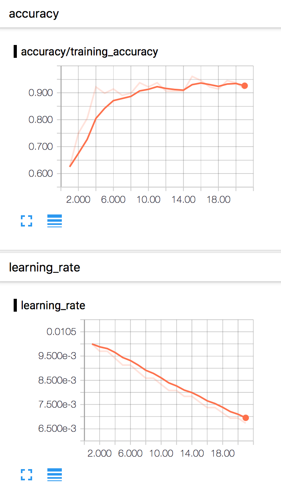
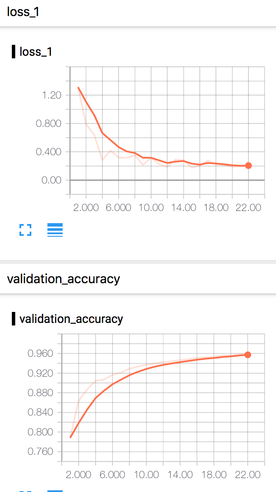

## MNIST 手写数字识别

##### 该项目主要使用 tensorflow 对 mnist 数据集进行手写数字识别

> 目录结构
- input_data.py: 加载 mnist 数据的基类；该文件可以不用看，是拷贝过来的加载 mnist 数据的文件
- base.py: 所有分类器都会继承该基类；里面封装了各种常用函数
- logistic.py: 逻辑回归
- bp_simply.py: bp 神经网络
- bp_with_tensorboard.py: bp 神经网络，运行过程的数据以及效果会记录到 tensorboard 中
- cnn_simply.py: cnn 卷积神经网络；同样使用了 tensorboard

 

> 准确率
- bp_with_tensorboard.py:
>>- training set accuracy: 0.981909%
>>- validation set accuracy: 0.977000%
>>- test set accuracy: 0.973800%
>
- cnn_simply.py:
>>- training set accuracy: 0.998100%
>>- validation set accuracy: 0.994200%
>>- test set accuracy: 0.993500%

 

> bp_with_tensorboard 训练过程的 tensorboard 截图

